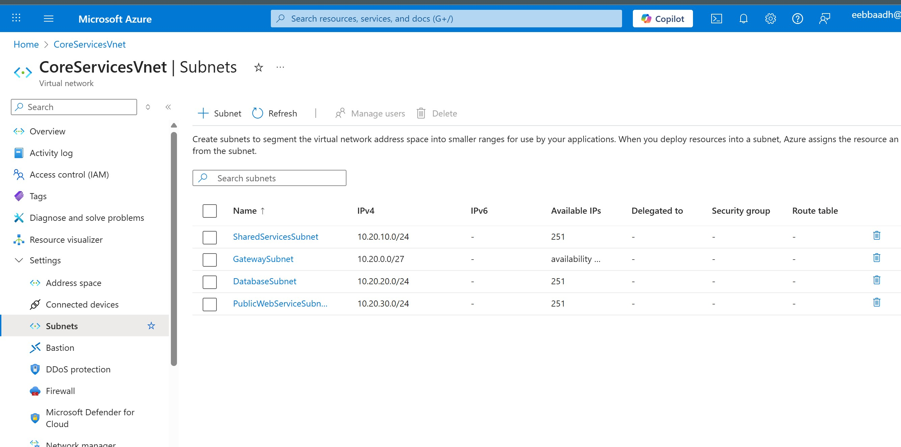

## LAB-1 Detailed Task Steps: Design and Implement a Virtual Network in Azure

## Task 1: Create the Contoso Resource Group

### 🔹 Azure Portal
1. Go to [Azure Portal](https://portal.azure.com)
2. Navigate to **Resource groups**
3. Click **+ Create**
4. Enter:
   - **Name**: `ContosoResourceGroup`
   - **Region**: `East US` (or preferred region)
5. Click **Review + Create**, then **Create**

### 🔹 PowerShell
New-AzResourceGroup -Name "ContosoResourceGroup" -Location "East US"

### Task 2: Create the CoreServicesVnet Virtual Network and Subnets
🔹 Address Space: 10.20.0.0/16

#### 🔹 Subnets:
- `GatewaySubnet` — `10.20.0.0/27`
- `SharedServicesSubnet` — `10.20.10.0/24`
- `DatabaseSubnet` — `10.20.20.0/24`
- `PublicWebServiceSubnet` — `10.20.30.0/24`

### 🛠️ Steps to Create the VNet and Subnets in Azure Portal

#### 🔸 Step 1: Navigate to Virtual Networks
1. Sign in to [Azure Portal](https://portal.azure.com)
2. In the left menu or top search bar, go to **Virtual networks**
3. Click **+ Create** or **+ Add**

---

#### 🔸 Step 2: Basics Tab
Fill out the following:
| Field | Value |
|-------|-------|
| **Subscription** | Your active Azure subscription |
| **Resource Group** | `ContosoResourceGroup` (create if it doesn't exist) |
| **Name** | `CoreServicesVnet` |
| **Region** | `East US` (or your preferred region) |

Click **Next: IP Addresses >**

#### 🔸 Step 3: Configure Address Space
- Under **IPv4 address space**, click **+ Add**
- Enter:10.20.0.0/16

---

#### 🔸 Step 4: Create Subnets

1. Click **+ Add subnet**
2. For each subnet, enter the following details and click **Add** after each:

| Subnet Name              | Subnet Address Range |
|--------------------------|----------------------|
| `GatewaySubnet`          | `10.20.0.0/27`       |
| `SharedServicesSubnet`   | `10.20.10.0/24`      |
| `DatabaseSubnet`         | `10.20.20.0/24`      |
| `PublicWebServiceSubnet` | `10.20.30.0/24`      |

After adding all, click **Next: Security >**

---

#### 🔸 Step 5: Skip Optional Tabs
- Leave **Security**, **Tags**, and other options with default values (unless instructed otherwise)
- Click **Next** until **Review + Create**

---

#### 🔸 Step 6: Review and Create
- Review your settings
- Click **Create**

Azure will deploy the Virtual Network and all defined subnets.

### Other option for creation of Vnets and subnets using CLI
🔹 Azure CLI
az network vnet create \
  --resource-group ContosoResourceGroup \
  --name CoreServicesVnet \
  --address-prefix 10.20.0.0/16 \
  --location "East US" \
  --subnet-name GatewaySubnet \
  --subnet-prefix 10.20.0.0/27

🔹Add other subnets

az network vnet subnet create \
  --resource-group ContosoResourceGroup \
  --vnet-name CoreServicesVnet \
  --name SharedServicesSubnet \
  --address-prefix 10.20.10.0/24

az network vnet subnet create \
  --resource-group ContosoResourceGroup \
  --vnet-name CoreServicesVnet \
  --name DatabaseSubnet \
  --address-prefix 10.20.20.0/24

az network vnet subnet create \
  --resource-group ContosoResourceGroup \
  --vnet-name CoreServicesVnet \
  --name PublicWebServiceSubnet \
  --address-prefix 10.20.30.0/24

#### 🔸 Step 7: Verify
1. Go to **Resource groups** → `ContosoResourceGroup`
2. Open `CoreServicesVnet`
3. Click **Subnets** on the left-hand menu under Setting
4. Confirm all 4 subnets are listed with correct address ranges

---

✅ You have now completed the creation of the `CoreServicesVnet` with its required subnets using the Azure Portal.

 ### Task 3: Create the ManufacturingVnet and Subnets
 ### (Repeate Step 1 to step 7 from Task 2)
🔹 Address Space: 10.30.0.0/16
🔹 Subnets:
ManufacturingSystemsSubnet — 10.30.10.0/24
SensorSubnet1 — 10.30.20.0/24
SensorSubnet2 — 10.30.21.0/24
SensorSubnet3 — 10.30.22.0/24
🔹 Azure CLI
az network vnet create \
  --resource-group ContosoResourceGroup \
  --name ManufacturingVnet \
  --address-prefix 10.30.0.0/16 \
  --location "West Europe" \
  --subnet-name ManufacturingSystemsSubnet \
  --subnet-prefix 10.30.10.0/24

🔹Add sensor subnets:
az network vnet subnet create \
  --resource-group ContosoResourceGroup \
  --vnet-name ManufacturingVnet \
  --name SensorSubnet1 \
  --address-prefix 10.30.20.0/24

az network vnet subnet create \
  --resource-group ContosoResourceGroup \
  --vnet-name ManufacturingVnet \
  --name SensorSubnet2 \
  --address-prefix 10.30.21.0/24

az network vnet subnet create \
  --resource-group ContosoResourceGroup \
  --vnet-name ManufacturingVnet \
  --name SensorSubnet3 \
  --address-prefix 10.30.22.0/24

### Task 4: Create the ResearchVnet and Subnet
### (Repeate Step 1 to step 7 from Task 2)
🔹 Address Space: 10.40.0.0/16
ResearchSystemSubnet — 10.40.0.0/24
🔹 Azure CLI
az network vnet create \
  --resource-group ContosoResourceGroup \
  --name ResearchVnet \
  --address-prefix 10.40.0.0/16 \
  --location "Southeast Asia" \
  --subnet-name ResearchSystemSubnet \
  --subnet-prefix 10.40.0.0/24

### Task 5: Verify the Creation of VNets and Subnets
🔹 Azure Portal
Go to Virtual Networks

Check each VNet: CoreServicesVnet, ManufacturingVnet, ResearchVnet

Confirm address space and subnets under each VNet

🔹 Azure CLI
az network vnet list --resource-group ContosoResourceGroup -o table
az network vnet subnet list --resource-group ContosoResourceGroup --vnet-name CoreServicesVnet -o table

