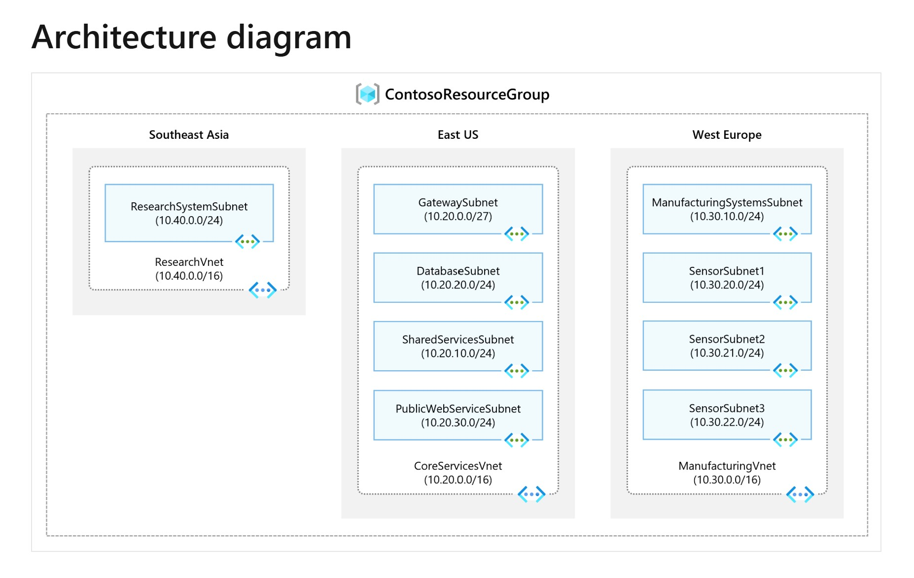

# LAB-1: Design and Implement a Virtual Network in Azure

## Lab Scenario

Contoso Ltd, a fictitious organization, is in the process of migrating its infrastructure and applications to Azure. As a network engineer, you are tasked with planning and implementing three virtual networks and their associated subnets across multiple Azure regions. This setup is foundational for enabling secure communication between applications and services hosted in Azure.

---

## Job Skills

In this lab, you will practice the following Azure networking skills:

- Create the **ContosoResourceGroup** in Azure.
- Deploy the **CoreServicesVnet** virtual network in **East US** with subnets:
  - GatewaySubnet
  - SharedServicesSubnet
  - DatabaseSubnet
  - PublicWebServiceSubnet
- Deploy the **ManufacturingVnet** virtual network in **West Europe** with subnets:
  - ManufacturingSystemsSubnet
  - SensorSubnet1
  - SensorSubnet2
  - SensorSubnet3
- Deploy the **ResearchVnet** in **Southeast Asia** with:
  - ResearchSystemSubnet
- Verify the creation of all VNets and subnets using the Azure Portal and Network Watcher.

---

## Architecture Diagram

The following diagram shows the required network design across three Azure regions:

---

## Virtual Network and Subnet Details

### Southeast Asia Region
- **VNet**: `ResearchVnet` — `10.40.0.0/16`
  - `ResearchSystemSubnet` — `10.40.0.0/24`

### East US Region
- **VNet**: `CoreServicesVnet` — `10.20.0.0/16`
  - `GatewaySubnet` — `10.20.0.0/27`
  - `SharedServicesSubnet` — `10.20.10.0/24`
  - `DatabaseSubnet` — `10.20.20.0/24`
  - `PublicWebServiceSubnet` — `10.20.30.0/24`

### West Europe Region
- **VNet**: `ManufacturingVnet` — `10.30.0.0/16`
  - `ManufacturingSystemsSubnet` — `10.30.10.0/24`
  - `SensorSubnet1` — `10.30.20.0/24`
  - `SensorSubnet2` — `10.30.21.0/24`
  - `SensorSubnet3` — `10.30.22.0/24`

---

## Tasks

1. **Create a Resource Group**
   - Name: `ContosoResourceGroup`
   - Region: Choose based on your primary deployment location

2. **Create Virtual Networks and Subnets**
   - Deploy the three VNets in their respective regions
   - Create the subnets with exact address spaces as listed above

3. **(Optional) Deploy Test VMs**
   - Create a VM in each subnet to verify internal connectivity
   - Use RDP, SSH, or ping between subnets where possible

4. **Verify Deployment**
   - Use **Azure Portal** to confirm VNet and subnet configurations
   - Use **Azure Network Watcher** for IP flow and connection diagnostics

---

## Validation Checklist

- [ ] All three VNets created with correct address spaces
- [ ] All subnets match the design
- [ ] No overlapping IP address spaces
- [ ] Subnet names are correct and associated with the right VNet
- [ ] Optional: Deployed VMs can reach each other based on expected network rules

---

## 📘 References
Exercise is taken from Microsoft learn module for AZ-700

- [Exercise: Design and implement a virtual network in Azure (Microsoft Learn)](
https://learn.microsoft.com/en-us/training/modules/introduction-to-azure-virtual-networks/4-exercise-design-implement-virtual-network-azure )

---

